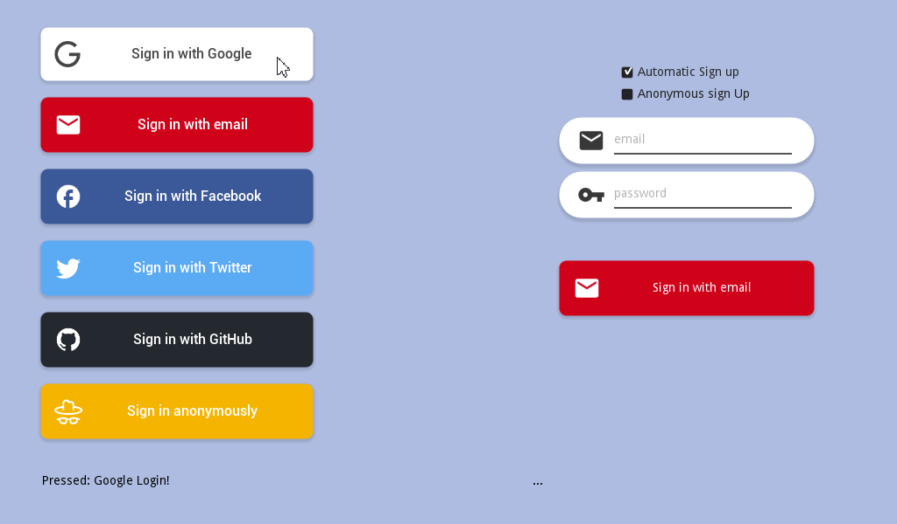

# GodotFirebase-UI

A library for Godot Engine built on top of [GodotFirebase addon](), and provides drop-in nodes with self-contained Authentication, Firestore, and Database functions.  
Instance a component, connect its signals, and you are ready!

## FirebaseUI
This library is inspired by [FirebaseUI](https://firebase.google.com/docs/auth/web/firebaseui), which is a library specifically built to implement ready-to-use components on top of the Firebase SDK.  
Along with the development of our addon [GodotFirebase], we decided to provide our own collection of Godot Engine components in the form of ready-to-use nodes, already configured to communicate with our library to facilitate Authentication, Firestore, and Database management, and so on.

## Components
*Components* are simple nodes with custom scripts and styles in a way that they are configurable both with GDScript and within the Inspector.  
Components can be grouped in three main categories:  
- Base Components, such as base buttons and fields: they can be further customized in aspect and functions
- Top Components, such as ready to use buttons (Google button, Anonymous login button), fields (email field, password field),  containers (Auth, Firestore, Database).
- Dynamic Components, such as a TileMap that has CRUD operations operating against Firestore for extremely dynamic map generation.

### List of available components
|Component|Usage|
|-|-|
|`CustomBaseButton (/buttons/base_button/base_button.tscn)`|A customizable basic button with icon and colored text|
|`EmailButton (/buttons/email_button/email_button.tscn)`|A button for email sign-up / sign-in processes|
|`EmailField (/field_containers/email_field/email_field.tscn)`|A field container for emails, with email-check logic|
|`SignContainer (/auth/sign_container/sign_container.tscn)`|A container for Firebase Authentication|
|`FirestoreTileMap (/tilemaps/firestore_tilemap/firestore_tilemap.tscn)`|A TileMap which provides CRUD operations combined with Firestore|
